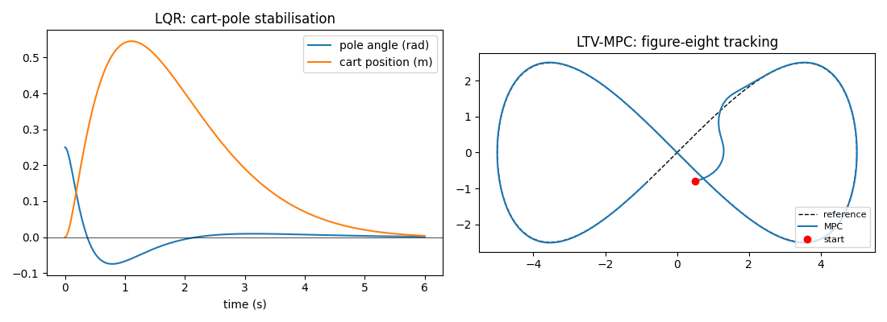

# robot-control-mpc

Model-based control for robots, implemented from first principles: **LQR** to balance a cart-pole and **linear time-varying MPC** to track a trajectory with a differential-drive robot under input limits.



## LQR: cart-pole

- Nonlinear cart-pole dynamics integrated with RK4.
- Discrete linearisation about the upright equilibrium (finite differences).
- Infinite-horizon gain from the discrete algebraic Riccati equation; the force is saturated at ±20 N.

Starting 0.25 rad (about 14°) from vertical, the pole is upright and the cart is back at the origin within 6 s.

## MPC: differential-drive tracking

- Unicycle model linearised along the reference at every step (LTV).
- The horizon is condensed into a QP over input deviations, with analytic gradients.
- Box constraints on speed (0–2 m/s) and turn rate (±1.5 rad/s), solved with L-BFGS-B.
- Receding horizon with warm starting.

Starting about 0.9 m off a figure-eight, the robot converges and then tracks with a mean error of about 7 mm, never exceeding its input limits.

## Run

```bash
pip install -e ".[dev]"
python examples/run_controllers.py --plot
pytest
```

```
LQR cart-pole: angle 0.25 rad -> 0.0013 rad after 6 s
MPC figure-eight: start error 0.94 m, mean error after 5 s 0.007 m, inputs within bounds: True
```

## Tests

- The Riccati solution satisfies the DARE, and the closed loop is stable.
- LQR balances the nonlinear cart-pole.
- The unicycle Jacobian matches finite differences.
- MPC tracks within 10 cm and respects every input bound.

## Extending

- State constraints (e.g. corridor bounds) via slack variables
- Nonlinear MPC with multiple shooting
- Obstacle avoidance using linearised distance constraints

## License

MIT
